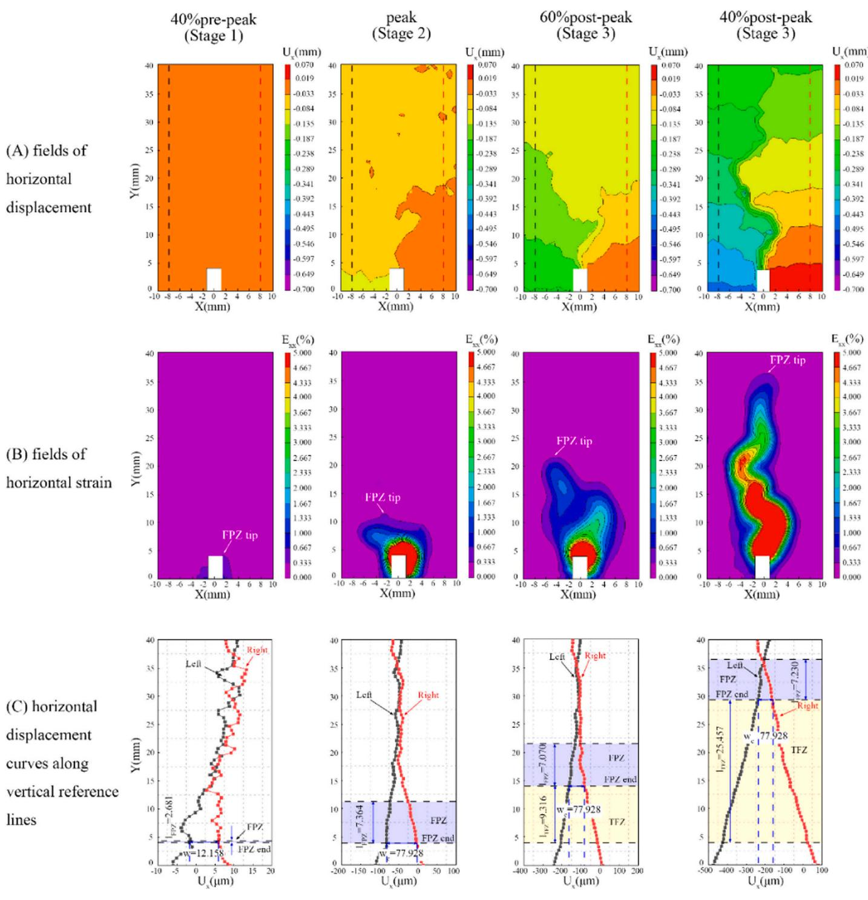
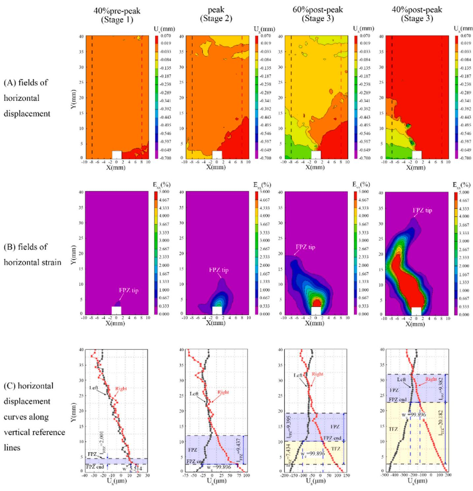
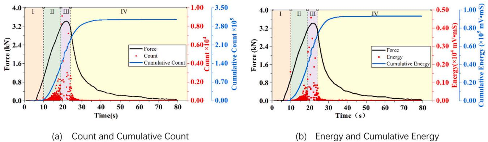

# 3. Results and discussion

# 3.1. Cracking resistance of asphalt concretes

It is necessary to determine the difference in cracking resistance of asphalt concrete, considering the variations in viscoelastic properties of asphalt material. The work of fracture $\left( \mathsf { W } _ { \mathrm { f } } \right)$ is critical in describing the ability to resist crack initiation and propagation [45]. It is calculated by dividing the total work done (i.e., the area under the load-displacement curve) by the fractured area, as shown in Fig. 4.

The Wf of NA concrete was quantified at $1 . 7 7 5 \mathrm { k N } { \cdot } \mathrm { m m }$ , accompanied by a peak load of $2 . 8 8 \mathrm { k N }$ . The corresponding load-displacement curve was characterized by a pronounced initial slope, indicative of considerable stiffness, and a subsequent precipitous decline, implying a deficiency in ductility, or a limited capacity for plastic deformation prior to fracture. In contrast to NA concrete, SBS concrete demonstrated a superior $\mathsf { W } _ { \mathrm { f } }$ of $2 . 7 7 \mathrm { k N } { \cdot } \mathrm { m m }$ . It also exhibited an augmented peak load of $3 . 0 2 \mathrm { k N }$ and a more extensive area under the load-displacement curve before the onset of decline, denoting an enhanced ability to absorb energy prior to failure and improved resistance to crack propagation relative to NA concrete. HVMA concrete exhibited the most substantial $\mathrm { W _ { f } } ,$ recorded at $3 . 1 1 4 \mathrm { k N } { \cdot } \mathrm { m m }$ , with a peak load of $3 . 4 2 \mathrm { k N }$ . The loaddisplacement curve for HVMA concrete extended over a broader displacement range before descending, signifying a superior energy absorption capacity and cracking resistance.

  
Fig. 4. Load-displacement curve and work of fracture.

# 3.2. Fracture stages and characteristics

# 3.2.1. Stage variation characteristic of DIC

According to method of Xue et al. [37], the fracture process of asphalt concrete under three-point bending can be categorized into three distinct stages, as illustrated in Fig. 5.

Initially, in Stage 1, crack openings are minimal, with the NA, SBS, and HVMA specimens exhibiting low crack opening rates $( 1 . 2 2 \mu \mathrm { m } / s ,$ $1 . 3 0 \mu \mathrm { m } / s$ , and $1 . 4 2 \mu \mathrm { m } / s$ , respectively), representing slow expansion of pre-existing cracks with few new microcracks on the specimen surface. As the load increases, the transition to Stage 2 occurs, characterized by a notable rise in the average CTOD change rate (around $2 0 \mu \mathrm { m } / \epsilon )$ compared to Stage 1, indicating accelerated damage expansion. This stage is marked by both an increase in the number and size of microcracks. Finally, Stage 3 commences following the peak load, where CTOD change rates exceed $9 0 \mu \mathrm { m } / s$ , indicative of rapid macroscopic crack expansion and a subsequent decrease in load. This stage is marked by a nearly linear growth in crack size. Understanding these stages is essential for predicting and assessing the failure behavior of asphalt concrete structures under real loading conditions.

DIC technique revealed progressive developments of the FPZ and TFZ at distinct moments: $4 0 ~ \%$ before pre-peak, peak, $6 0 \%$ post-peak, and $4 0 ~ \%$ post-peak, Each corresponding to different damage stages. Figs. 6–8 (A) and (B) illustrate the displacement and strain fields at these stages, while Figs. 6–8 (C) demonstrates the gradual evolution of the FPZ and the TFZ, color-coded as yellow and blue, respectively. Compared to displacement fields, strain fields provide a more intuitive visualization of discontinuous deformation, thus offering clearer insights into the crack propagation. To determine the expansion characteristics of the TFZ or the actual crack path, displacements were measured at various load levels along two vertical reference lines, located $8 \mathrm { m m }$ from the centerline of the precut notch, as shown in Figs. 6–8 (A). The critical crack opening displacement (COD), denoted as $w _ { c }$ , was determined at the peak load, and it signifies the transition point between the FPZ and TFZ.

  
Fig. 5. Evolution of CTOD and loading curve throughout loading process.

At the initial loading stage, localized discontinuous deformation was observed above the tip of the pre-cut notch when the load reached $4 0 \%$ of the peak, indicating the initial of FPZ development. As the load increased, microcracks gradually formed, leading to a continuous growth in the length of the FPZ. Upon reaching the peak load, the opening displacement at the notch tip reached the critical value $w _ { c }$ , signifying a fully developed FPZ. The fully developed FPZ lengths for NA, SBS, and HVMA concretes were approximately $7 . 3 6 4 ~ \mathrm { m m }$ , $9 . 4 3 7 \mathrm { m m }$ , and $1 4 . 0 7 9 \mathrm { m m }$ , respectively, as shown in Figs. 6–8 (2). According to the displacement curve data in Figs. 6–8 (C-2), the critical COD at peak load for different materials were $7 7 . 9 2 8 \mu \mathrm { m }$ , $9 9 . 8 9 6 \mu \mathrm { m }$ , and $1 1 9 . 8 5 8 \mu \mathrm { m }$ , respectively. Combined with the results presented in Section 3.1, concretes with better cracking resistance tend to have larger fully developed FPZ lengths and higher critical COD. This suggests a strong correlation between the viscoelastic properties of asphalt materials and both the FPZ length and critical COD. This inference is consistent with the conclusion by Doll et al. [19] that material embrittlement occurs concurrently with a decrease in the size of the FPZ. It is commonly believed that the size of the FPZ influences the material’s fracture toughness. A larger FPZ allows the material to absorb more energy before fracturing, thereby exhibiting higher fracture toughness. Consequently, SBS concrete and HVMA concrete demonstrate superior cracking resistance compared to the NA concrete.

When the load enters the post-peak stage, the FPZ tip advances while the TFZ forms and propagates along the macroscopic crack expansion path. Notably, the crack propagation path, as shown in Figs. 6 and 7 (B) and (C), does not strictly follow the direction of maximum principal stress. Instead, the crack propagation often exhibits a serrated pattern due to the heterogeneity of the concrete. Throughout the crack propagation, the FPZ length remains relatively constant. Specifically, for NA specimen, the FPZ length is $7 . 0 7 0 \mathrm { m m }$ at $6 0 \%$ post-peak load and $7 . 2 3 0 \ : \mathrm { m m }$ at $4 0 \%$ post-peak. For SBS and HVMA concretes, the FPZ lengths are $9 . 3 9 5 \ : \mathrm { m m }$ and $9 . 3 8 2 \ : \mathrm { m m }$ at $6 0 \%$ post-peak load, and $1 4 . 1 0 2 \mathrm { m m }$ and $1 4 . 0 5 9 \mathrm { m m }$ at $4 0 ~ \%$ post-peak load, respectively.

  
Fig. 6. Analysis of the FPZ and TFZ in concrete sample with NA concrete under different fracture stages.

# 3.2.2. Temporal evolution characteristics with AE parameters

While DIC provides detailed information about the initiation and propagation of surface cracks, which helps to understand the fracture mechanisms in concrete, it is essential to consider the internal damage progression of asphalt concrete, particularly the early damage before surface cracking occurs. Therefore, a comprehensive analysis of AE parameters was performed to explore the characteristic patterns of concrete internal cracking behaviors at various development stages. Figs. 9–11 present a comparative analysis of the temporal evolution of AE parameters for three different materials over time. It was observed that counts, cumulative count, energy, and cumulative energy exhibit distinct stage-specific characteristics for each material. Notably, a sudden increase in these parameters tend to occur simultaneous for a given material, suggesting transitions in the damage process. The damage process is preliminarily categorized into four stages based on three simultaneous abrupt changes: specimen deformation (Stage I), microcrack initiation and concentration (Stage II), macroscopic crack formation and stable expansion (Stage III), and macroscopic crack unstable expansion (Stage IV). The damage behavior of each stage inferred from the AE parameters is detailed as follows.

  
Fig. 7. Analysis of the FPZ and TFZ in concrete sample with SBS concrete under different fracture stages.

In Stage I, following a 6 second preloading period, the loading curve exhibits a brief period of linear growth. During this phase, AE count and energy values remain relatively low, while a gradual increase is noted in cumulative count and energy. This suggests that the internal structure of asphalt concrete specimen undergoing a self-adjustment process. At lower load levels, initial voids within the specimen may close, and the contact or friction between rough surfaces could result in weak AE activity.

Upon entering Stage II of concrete damage evolution, the AE activity in asphalt concrete becomes more pronounced, as evidenced by a moderate rise in both cumulative count and energy. This phenomenon is largely attributed to the random initiation of microcracks and the initial formation of damage zones due to stress concentration. The continuous increase in cumulative AE parameters suggests that microcracks are accumulating and expanding during this stage. By the end of this stage, macroscopic cracks have emerged within the specimen. As the escalation of load levels, there is a noticeable reduction in the frequency of AE events, leading to sparse areas in the time distribution of AE count and energy. A similar phenomenon was observed in the study of Qiu et al. [46].

  
Fig. 8. Analysis of the FPZ and TFZ in concrete sample with HVMA concrete under different fracture stages.

This reduction signifies the transition of concrete damage evolution into Stage III. In this phase, although the overall number of AE events diminishes significantly, each event is characterized by increased count and energy levels. This suggests that at this stage, instances of crack formation or expansion are frequently linked with significant energy release, reflecting a transition in the specimen’s damage state from microscopic to macroscopic cracking. Furthermore, after the peak load is reached, a linear decline in the loading curve is observed, especially evident in the NA specimen. Following the linear decline, the damage evolution advances into Stage IV. In this stage, AE activity significantly decreases in both count and energy, returning to levels similar to Stage II. This reduction in AE activity corresponds with the expansion of macroscopic cracks. Simultaneously, the growth of cumulative AE energy and count levels off, suggesting a stabilization phase in the damage progression. Cracks and defects within concrete significantly impact its mechanical properties. The AE process in loaded concrete is governed by its internal structure and changes therein. Additionally, AE signals provide extensive information about internal structural changes. A detailed analysis of cumulative AE energy, amplitude, and count rate effectively characterizes the dynamic damage process of asphalt concrete, categorizing it into four distinct stages. Abrupt simultaneous changes in AE parameters serve as criteria for assessing transitions in asphalt concrete damage behavior. Therefore, it is reasonable to evaluate the fracture performance of asphalt concrete based on the critical points between these damage stages.

  
Fig. 9. Temporal evolutions of the load and AE characteristics of NA concrete.

  
Fig. 10. Temporal evolutions of the load and AE characteristics of SBS concrete.

  
Fig. 11. Temporal evolutions of the load and AE characteristics of HVMA concrete.

Based on the previous discussion about the damage progress monitored by DIC and AE techniques, a comparative analysis for identifying different cracking stages in asphalt concrete was conducted in this study. It found that DIC effectively tracks surface crack growth, aligning its stages 2 and 3 with AE’s stages III and IV. AE excels in early damage detection, identifying minor internal defects before they are visible, placing its initial stages I to stage II within DIC’s stage 1. This shows that early-stage damage detected by AE often corresponds to DIC’s stage 1, demonstrating a significant overlap in their early damage detection capabilities. As damage progresses, both methods show a high level of agreement, with both internal stress and surface changes being closely monitored, leading to consistent detection of later-stage damage.

# 3.2.3. Comparative analysis of DIC and AE

In order to better explore and quantify the correlation between surface crack propagation and AE events, both CTOD and the cumulative count of AE data were normalized to their respective maximum values. A strong correlation is observed between these two normalized parameters, as shown in Fig. 12.

In contrast to the typical linear or quasi-linear correlation between crack propagation and cumulative count observed in elastic materials, such as rocks and alloys [47–49], the relationship between normalized CTOD and normalized cumulative count in asphalt concrete, which exhibits elastic and viscous properties, can be delineated into three distinct phases. Initially, prior to the peak load $\mathrm { ( F _ { m a x } ) }$ , there is a marked increase in the normalized cumulative count alongside a rise in normalized CTOD, suggesting a linear and positive correlation. This pattern implies that substantial internal structural changes and damages have occurred before visible cracks appear on the specimen’s surface, highlighting the advanced capability of AE technique for early damage detection, particularly for internal damages. Upon reaching the $\operatorname { F } _ { \mathrm { m a x } } ,$ the curve shifts to a nonlinear growth phase, where the rate of increase in AE events no longer directly correlate with the crack growth rate. This shift in the crack growth mode, possibly due to the coalescence of multiple microcracks into larger cracks, may account for the observed deceleration in growth rate. In the terminal phase, the normalized cumulative count plateaus near a normalized value of 1.0, while the normalized cumulative count growth rate approaches zero, thereby forming a horizontal asymptote. This indicates that the crack has traversed the majority of the material, and the diminishing generation of AE events may signify that the crack is nearing complete fracture. As elasticity increases, the curves demonstrate a more pronounced deviation from the initial linear correlation between CTOD and cumulative count, with the SBS and HVMA concretes showing a distinctly nonlinear behavior, especially after the peak load.

  
Fig. 12. Crack extension in relation to the cumulative count.

The three distinct phases of correlation curve may provide a framework for assessing the cracking resistance of different materials. The ability of asphalt concrete to withstand cracking can be inferred from the values of normalized cumulative count at $\operatorname { F } _ { \mathrm { m a x } } ,$ which marks the end of the linear phase, and the normalized CTOD measurements at the end of the non-linear phase. Materials with higher normalized cumulative counts at a given normalized CTOD value generally exhibit better cracking resistance because higher AE counts indicate more energy is being absorbed by the materials before failure. As shown in Fig. 12, despite similar normalized CTOD values at $\operatorname { F } _ { \mathrm { m a x } } ,$ three concretes show varying normalized cumulative counts. The HVMA concrete, with the best cracking resistance, has the highest normalized cumulative count, followed by SBS concrete, while NA concrete has the lowest. Furthermore, at a specific normalized cumulative count value, a lower normalized CTOD value implies stronger cracking resistance. As the normalized cumulative count approaches the horizontal asymptote at the end of the non-linear stage, the corresponding normalized CTOD reflects the concrete’s cracking resistance. As depicted in Fig. 12, the HVMA concrete, with the best cracking resistance, has the smallest normalized CTOD, followed by SBS concrete, while the NA records the largest. These findings suggest that increased normalized cumulative count at $\operatorname { F } _ { \mathrm { m a x } }$ and decreased normalized CTOD at the end of the nonlinear stage are reliable indicators of asphalt concrete’s cracking resistance.

# 3.3. Identification of critical damage state

As the loading process advances, the changing patterns of AE parameters periodically disclose the onset and development of initial damages in the specimen. Studying the transition of damage states and the characteristics of damage evolution in asphalt concrete is essential for comprehending its fracture behaviors and assessing its resistance to cracking. The correlation dimension is used to quantify the complexity of the AE signal, which can provide insights into the fracture stages of the samples [50]. The correlation dimension D calculated from the AE count rate, as depicted in Fig. 13, reflects the alterations in three types of asphalt concrete along the load-time curve.

During the initial loading phase, a rising trend was observed in the correlation dimension D for all three materials. Notably, there was a significant reduction in the correlation dimension D observed prior to reaching $\operatorname { F } _ { \mathrm { m a x } } .$ . This reduction, characterized by a swift decline in the correlation dimension D to a lower level, occurred at distinct load percentages for each material: $6 2 \%$ of $\operatorname { F } _ { \mathrm { m a x } }$ for NA concrete, $9 2 ~ \%$ of $\operatorname { F } _ { \mathrm { m a x } }$ for SBS concrete, and $9 6 \%$ of $\operatorname { F } _ { \operatorname* { m a x } }$ for HAMA concrete. Following this phase, the correlation dimension D exhibited a recovery of varying extents, subsequently transitioning into a phase characterized by unpredictable or oscillatory fluctuations.

  
Fig. 13. Correlation dimension D versus time.

The fracture failure of asphalt concrete can generally be interpreted as a progressive transformation. This progression transitions from a state of disorder to order. Correspondingly, this is mirrored in the evolution of AE that is linked with the deformation and material damage failure. It is generally considered that a decrease in the correlation dimension signifies an increase in the orderliness of the AE process. This transition from a random to an ordered state is externally manifested during the testing process through the observation of microcracks, concentration of fissures, and formation of microcrack zones. The damage phases delineated by the AE parameters (Figs. 9–11) and the changes in the correlation dimension showed good correlation. The stage I and stage II, defined based on AE parameters, correspond to the specimen deformation phase and the microcrack nucleation and concentration phase, respectively. During Stage I, the initial voids within the specimen close, and some rough surfaces make contact or rub against each other, generating AE signals. In Stage II, the random formation of microcracks within the specimen results in the release of more AE signals. The generation of these two types of AE signals is random and lacks a clear pattern, thereby increasing the disorderliness of the failure forms. Consequently, the correlation dimension D experienced varying degrees of increase during these two phases. As the internal damage of the specimen progressed, there was a notable decrease in the correlation dimension D, signifying a more orderly internal damage pattern at this stage, potentially suggestive of macrocrack formation. This shift implies that the damage was predominantly extending and expanding on a larger scale. Notably, the moments of the rapid decline in the correlation dimension D appear to correlate with the cracking resistance characteristics of asphalt concrete. Improved cracking resistance results in the point of rapid decline being closer to $\operatorname { F } _ { \operatorname* { m a x } }$ . Therefore, the viscoelastic properties of the asphalt material play a significant role in asphalt cracking resistance.

As macrocracks propagate, the specimen rapidly loses its post-peak bearing capacity, ultimately leading to fracture. During this process, the correlation dimension D entered a fluctuating state, highlighting the complexity of the damage evolution process during this stage. The existence of larger aggregates impedes the direct upward propagation of cracks within the specimen to. During loading, the interaction or friction between defects from microcracks in the FPZ and gaps from macrocracks in the FTZ generates AE signals. These signals exhibit a high degree of disordered. Conversely, the continuous expansion and propagation of macrocracks, which yield more orderly AE signals, coexist with this disorder. Together, they shape the fluctuation pattern of correlation dimension D.

The analysis presented herein demonstrates that correlation dimension derived from AE count rate can effectively characterizes the critical fracture state during the internal crack progression in asphalt concrete. This method provides a quantitative assessment of the degree of disorder in the crack patterns, which is indicative of the material’s progression towards failure.

Furthermore, the AE b-value, calculated from AE signal amplitude distributions, was utilized to assess the intensity of AE activity during the entire fracture process of asphalt concretes. Generally, the regular variation of the b-value across different stages of failure can serve as an indicator of material damage severity. A higher b-value corresponds to smaller amplitude impacts, which suggests a gradual initiation of cracks and a slower rate of propagation. On the other hand, a decrease in the bvalue implies a relative increase in larger amplitude AE impacts. This is indicative of faster and more unstable crack propagation, suggesting more severe material damage. Fig. 14 illustrates the variation in AE amplitude and b-values for NA concrete, SBS concrete, and HVMA concrete throughout the damage process.

This study analyzes the intensity variation of AE activity throughout the entire damage process of these three materials, using b-value calculated from the distribution of AE amplitude. The results indicate that the b-value curves for all three materials follow a similar ’S’ shaped pattern. Initially, there is a rapid decline in b-value, which then slows until reaching a minimum. Subsequently, the b-value experiences a period of fluctuating ascent. After reaching its peak, the b-value declines again.

  
Fig. 14. AE b-value versus time.

The b-value continuously decreases during the stage in which damage begins to occur, i.e., stages II and III. The rate of decline was significantly higher in stage II than in stage III. Generally, the inflection point in the b-value curve’s rate of decrease is observed during the transition from Stage II to Stage III. This could be attributed to an accelerated rate of microcrack nucleation with the load level in Stage II, resulting in macrocrack formation prior to the onset of Stage III. In Stage

III, the b-value continues to decrease, hitting its lowest point at the end of Stage III or the start of Stage IV. This trend suggests that macrocracks developed at the end of Stage II persist in propagating under the load. At the end of Stage III or the beginning of Stage IV, the dominant macrocracks will extend further and eventually traverse the entire specimen. Finally, after the b-value declines to its minimum, it begins to increase again, followed by another decline after reaching a certain threshold.

Thus, it can be concluded that the inflection points, where the AE bvalue starts to increase from its minimum, may serves as a precursor to the complete fracture of asphalt concrete. The variations in the AE bvalue effectively describe the stage characteristics of the damage and cracking process in asphalt concrete.
